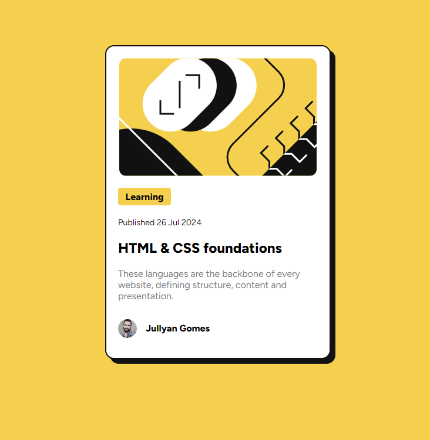

# Frontend Mentor - Blog preview card solution

This is a solution to the [Blog preview card challenge on Frontend Mentor](https://www.frontendmentor.io/challenges/blog-preview-card-ckPaj01IcS). Frontend Mentor challenges help you improve your coding skills by building realistic projects. 

## Table of contents

- [Overview](#overview)
  - [Screenshot](#screenshot)
  - [Links](#links)
- [My process](#my-process)
  - [Built with](#built-with)
  - [What I learned](#what-i-learned)
  - [Continued development](#continued-development)
  - [Useful resources](#useful-resources)
- [Author](#author)
- [Acknowledgments](#acknowledgments)


## Overview

### Screenshot



### Links

- Solution URL: [FrontendMentor](https://your-solution-url.com)
- Live Site URL: [Netlify](https://lighthearted-hotteok-81520e.netlify.app/)

## My process

### Built with

- Semantic HTML5 markup
- CSS custom properties
- Flexbox
- Desktop-first workflow
### What I learned

What I liked about this challenge was that I learned how to center a div properly. Using a container **div** to help me center the **img** tag was helpful.

```html
<div class="container__illustration">
    
</div>
```


```css
.container__illustration {
    display: flex;
    justify-content: center;
    width: 100%;
}

.illustration{
    max-width: 100%;
    border-radius: 12px;
}
```

### Continued development

I'd like to learn more on how to use JS to make my projects interactive.

## Author

- Frontend Mentor - [@jullyanvpr](https://www.frontendmentor.io/profile/jullyanvpr)


## Acknowledgments

I'd like to thank Kevin Powell for making CSS easier to newbies and frontendmentor for these nice projects.
